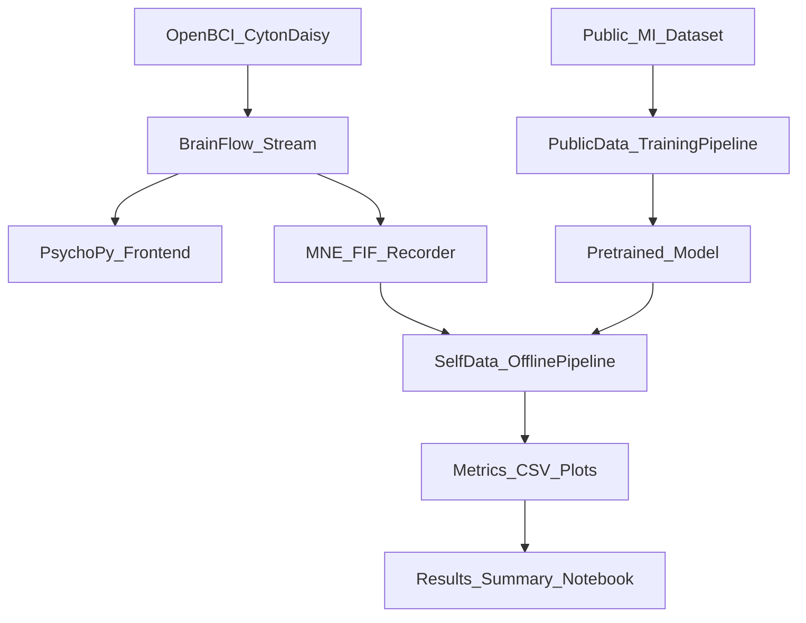

# EEG Motor Imagery Classification (Headset App + Training Pipeline + Results)

This repo is a **portfolio-ready, end-to-end motor-imagery EEG project** with three runnable components:

1) **Headset-facing “frontend” app** (PsychoPy + BrainFlow) for online cueing + feedback  
2) **Offline processing + model training pipeline** (classical + deep learning; transfer learning supported)  
3) **Results notebook** that summarizes offline accuracies across settings (and saves plots/tables)

The core motivation is practical BCI engineering: **small labeled datasets** and **domain shift** (public datasets → a new user / a different headset). The repo is structured to make it easy to:
- collect a few runs with a consumer EEG setup,
- benchmark classical baselines vs deep models,
- and summarize results in a single report notebook.

## Repo layout

```
apps/
  headset_frontend/           # hardware + demo replay frontend
pipeline/
  src/pipeline/public/        # public-dataset training scripts (expects processed epochs)
  src/pipeline/self/          # self-data training + classical baselines
notebooks/
  results_summary.ipynb       # report notebook (repo-relative paths)
data/
  self/                       # self-collected FIF runs (sanitized)
scripts/
  sanitize_fif_metadata.py
  download_public_dataset.py
configs/
  default.yaml
requirements/
  base.txt
  frontend.txt
  ml.txt
legacy/                       # snapshot of the original project layout (for reference)
```

## Quickstart

### Install

This is a Python-only project. Start with a clean Python 3.10+ environment.

```bash
python -m pip install -r requirements/base.txt
python -m pip install -e .
```

Install the optional dependency sets depending on what you want to run:

```bash
# Headset app (BrainFlow + PsychoPy)
python -m pip install -r requirements/frontend.txt

# Model training + classical baselines
python -m pip install -r requirements/ml.txt
```

Notes:
- **PsychoPy** can require OS-level dependencies on Linux. If install fails, use the demo paths that don’t require PsychoPy, or install PsychoPy via your preferred method for your distro.

### 1) Headset frontend (no hardware demo)

Replay a recorded run and drive the PsychoPy bar UI without a headset connected:

```bash
eeg-headset-frontend --demo-fif data/self/sub-01_run-01_online_raw.fif
```

### 2) Self-data pipeline (fast classical baseline)

Run a quick CSP + RandomForest baseline on the included self-recorded runs:

```bash
eeg-self-train --data-dir data/self --runs 01 02 --simple-model rf --model-name quick_rf
```

Outputs are written under `runs/self/` by default.

### 3) Results notebook

Open:
- `notebooks/results_summary.ipynb`

The first setup cell finds the repo root automatically and uses:
- self-data: `data/self/`
- outputs: `runs/self/`

## Public dataset (download locally; not committed)

The public dataset is intentionally excluded from git (too large). To generate processed epochs compatible with the training scripts:

```bash
python scripts/download_public_dataset.py --subjects 1 2 3 --runs 3 7 11
export PUBLIC_PROCESSED_DATA_DIR=data/public/processed_data
```

Then run (compute-heavy):

```bash
eeg-public-train --pretrain
```

## Architecture (high level)



## Data and privacy notes

- **Self-collected `.fif` runs** are included under `data/self/`. Before inclusion, metadata sanitization is performed via:
  - `scripts/sanitize_fif_metadata.py`
- **Public dataset** and **derived public processed epochs** are excluded by `.gitignore` and are intended to be generated locally.

## What to look at (for a quick code review)

- **Headset app**: `apps/headset_frontend/src/headset_frontend/online_mi_pipeline.py`
- **Self-data training**: `pipeline/src/pipeline/self/train_offline_model.py`
- **Classical baseline**: `pipeline/src/pipeline/self/mi_riemann_probe.py`
- **Public training entrypoint**: `pipeline/src/pipeline/public/run.py` (wrapped by `pipeline/src/pipeline/public/train.py`)
- **Results notebook**: `notebooks/results_summary.ipynb`

## Limitations / future work

- **Session drift**: run-wise generalization remains challenging (nonstationarity).
- **Online inference**: integrating the best offline model into the online loop (latency + calibration) can be improved and validated more rigorously.
- **Packaging**: some public-pipeline code is still “script-style”; the wrappers keep it runnable without a full refactor.

