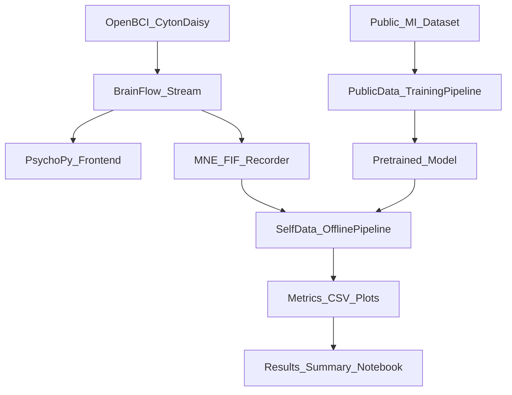

# EEG Motor Imagery Classification (Headset App + Training Pipeline + Results)

This repo is an end-to-end motor-imagery EEG project with three runnable components:

1) **Headset-facing “frontend” app** (PsychoPy + BrainFlow) for online cueing + feedback  
2) **Offline processing + model training pipeline** (classical + deep learning; transfer learning supported)  
3) **Results notebook** that summarizes offline accuracies across settings (and saves plots/tables)

## Repo layout

```
apps/
  headset_frontend/           # hardware + demo replay frontend
pipeline/
  src/pipeline/public/        # public-dataset training scripts (expects processed epochs)
  src/pipeline/self/          # self-data training + classical baselines
notebooks/
  results_summary.ipynb       # report notebook (repo-relative paths)
data/
  self/                       # self-collected FIF runs (sanitized)
scripts/
  sanitize_fif_metadata.py
  download_public_dataset.py
configs/
  default.yaml
requirements/
  base.txt
  frontend.txt
  ml.txt
legacy/                       # snapshot of the original project layout (for reference)
```

## Quickstart

### Install

This is a Python-only project. Start with a clean Python 3.10+ environment.

**Default (recommended): full install**

```bash
python -m pip install -e ".[all]"
```

If the full install fails (most commonly due to **PsychoPy/BrainFlow** system dependencies on Linux, or CUDA/PyTorch setup), you can install a smaller subset and still run most of the repo:

```bash
# Base (offline analysis + utilities)
python -m pip install -e ".[base]"

# Training + classical baselines (no headset app)
python -m pip install -e ".[base,ml]"

# Headset app only (no ML training stack)
python -m pip install -e ".[base,frontend]"
```

Notes:
- **PsychoPy** can require OS-level dependencies on Linux. If install fails, see the [PsychoPy website](https://www.psychopy.org/download.html).

### 1) Headset frontend (no hardware demo)

Replay a recorded run and drive the PsychoPy bar UI without a headset connected:

```bash
eeg-headset-frontend --demo-fif data/self/sub-01_run-01_online_raw.fif
```

The demo replays in **real time** by default. To speed up or slow down:

```bash
eeg-headset-frontend --demo-fif data/self/sub-01_run-01_online_raw.fif --demo-speed 2.0
```

### 1b) Record your own data (hardware)

This repo’s “frontend” is a PsychoPy + BrainFlow app designed for **OpenBCI Cyton + Daisy** (16 channels) recordings.

#### Prereqs
- A supported EEG device (tested with **OpenBCI Cyton + Daisy**)
- BrainFlow installed (`pip install -e ".[frontend]"`)
- On Linux you may need:
  - permissions to access the serial device (e.g. adding your user to `dialout`)
  - PsychoPy system dependencies (see PsychoPy docs)

#### Record a run (cueing + raw recording)

This writes an MNE Raw `.fif` containing EEG + a marker channel:
- Output naming: `sub-<ID>_run-<NN>_online_raw.fif`

Run from the repo root:

```bash
mkdir -p data/self
cd data/self
eeg-headset-frontend --subject 01 --run 1 --trials 120
```

Tips:
- Use a new `--run` number each session (it’s also used as the RNG seed for balanced cue ordering).
- If auto-detecting the serial port fails, pass `--port <device_path>` (see `--help`).
- Use `--game` for the gamified feedback view.

#### Sanitize before sharing

If you plan to publish your recordings, sanitize FIF metadata:

```bash
python scripts/sanitize_fif_metadata.py data/self --overwrite
```

### 2) Self-data pipeline (fast classical baseline)

Run a quick CSP + RandomForest baseline on the included self-recorded runs:

```bash
eeg-self-train --data-dir data/self --runs 01 02 03 04 05 06 --simple-model rf --model-name quick_rf
```

Outputs are written under `runs/self/` by default.

### 3) Results notebook

Open:
- `notebooks/results_summary.ipynb`

The first setup cell finds the repo root automatically and uses:
- self-data: `data/self/`
- outputs: `runs/self/`

## Public dataset (download locally; not committed)

The public dataset is intentionally excluded from git (too large). The public training code (`eeg-public-train`) expects **preprocessed epochs** at:

- `data/public/processed_data/sub-XXX_run-R_processed-epo.fif`

You can generate these locally with `scripts/download_public_dataset.py`.

Set the environment variable so the training code can find your processed epochs:

```bash
export PUBLIC_PROCESSED_DATA_DIR=data/public/processed_data
```

### Option A: quick smoke test (small)

Useful to validate your environment and that the preprocessing is working:

```bash
python scripts/download_public_dataset.py --subjects 1 2 3 --runs 3 7 11
```

### Option B: full pretrain setup (recommended)

To match the default pretraining config in `pipeline/src/pipeline/public/run.py` (which trains a base model on **90 subjects**), you’ll want processed epochs for *many* subjects.

This downloads and preprocesses motor-imagery runs (3/7/11) for subjects 1–109:

```bash
python scripts/download_public_dataset.py --subjects $(seq 1 109) --runs 3 7 11
```

## Training the “best” model (public pretrain → transfer to your headset data)

This is the intended high-performance workflow:

1) **Preprocess** the public dataset into `data/public/processed_data` (Option B above).

2) **Pretrain** on many public subjects (compute-heavy). This writes:
- `models/base_model_<N>_subjects.pt` where \(N\) is the **number of subjects actually loaded**.

Note: the default `eeg-public-train` configuration *targets* 90 training subjects (and holds out 10 test subjects) from the 109 available. If you only preprocess a few subjects, \(N\) will be smaller and the checkpoint name will reflect that.

```bash
eeg-public-train --pretrain
```

3) **Fine-tune / transfer** to your self-collected runs:

Use either:
- the model you just trained at `models/base_model_<N>_subjects.pt`, or
- the included reference checkpoint at `legacy/model/models/base_model_90_subjects.pt`

```bash
eeg-self-train \
  --data-dir data/self \
  --runs 01 02 03 04 05 06 \
  --base-model-path models/base_model_<N>_subjects.pt \
  --model-name offline_transfer_custom
```

The result will be logged to `runs/self/results/offline_metrics.csv` and included in `notebooks/results_summary.ipynb`.

## Architecture (high level)



## Data and privacy notes

- **Self-collected `.fif` runs** are included under `data/self/`. Before inclusion, metadata sanitization is performed via:
  - `scripts/sanitize_fif_metadata.py`
- **Public dataset** and **derived public processed epochs** are excluded by `.gitignore` and are intended to be generated locally.

## Code sections

- **Headset app**: `apps/headset_frontend/src/headset_frontend/online_mi_pipeline.py`
- **Self-data training**: `pipeline/src/pipeline/self/train_offline_model.py`
- **Classical baseline**: `pipeline/src/pipeline/self/mi_riemann_probe.py`
- **Public training entrypoint**: `pipeline/src/pipeline/public/run.py` (wrapped by `pipeline/src/pipeline/public/train.py`)
- **Results notebook**: `notebooks/results_summary.ipynb`

## Limitations / future work

- **Session drift**: run-wise generalization remains challenging (nonstationarity).
- **Online inference**: integrating the best offline model into the online loop (latency + calibration) can be improved and validated more rigorously.

## What’s intentionally missing (for portability)

- The full **public dataset** payload is not included (too large). Use `scripts/download_public_dataset.py`.
- GPU/CUDA setup is not automated (varies by machine). If `torch` install is finicky, use `python -m pip install -e ".[base]"` or `".[base,frontend]"` and still run the demo + classical baselines.

